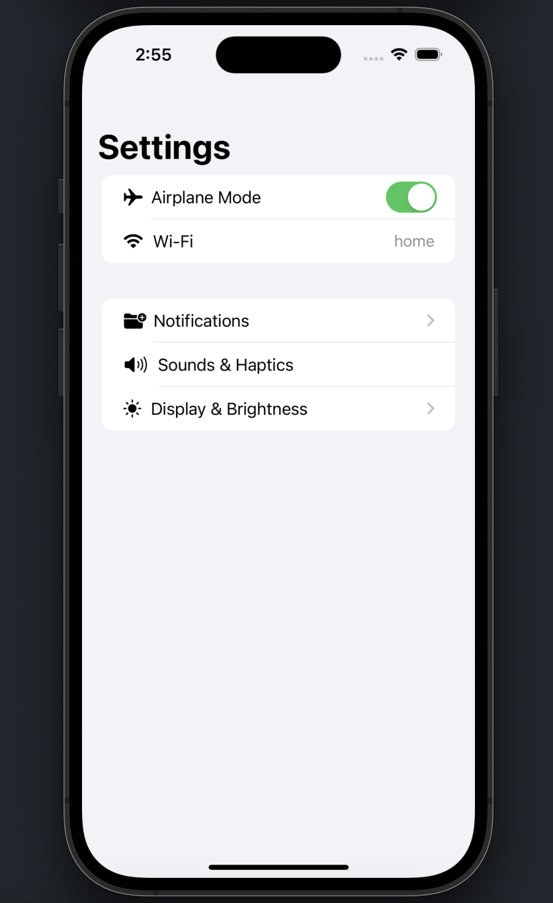
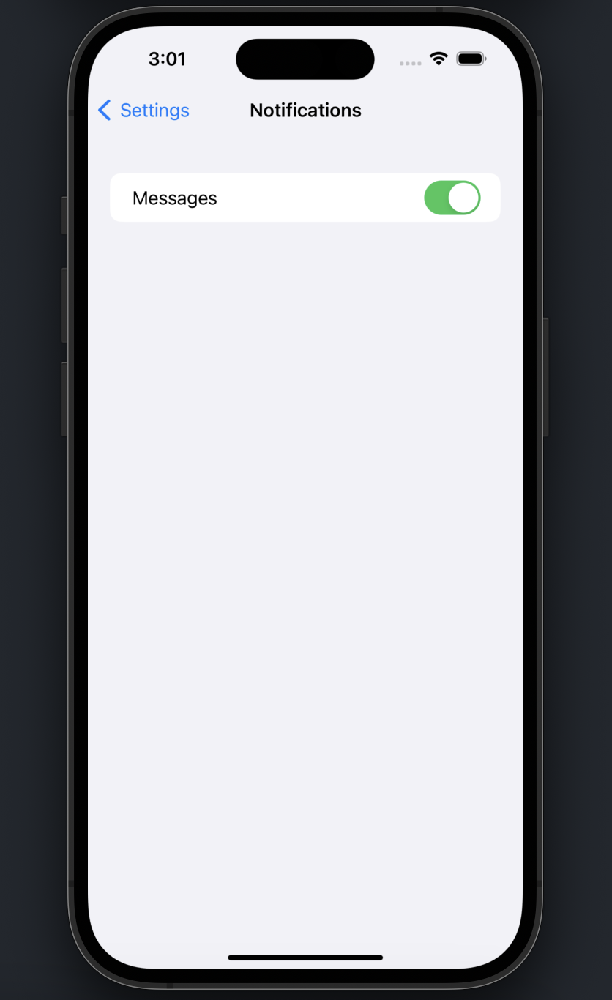

## Settings Screens

A simple project just to put SwiftUI 'view' concepts into practice for learning purposes / Projeto simples apenas para colocar em prática conceitos de "view" no SwiftUI com objetivo de aprendizagem

## Screenshots

  
  

