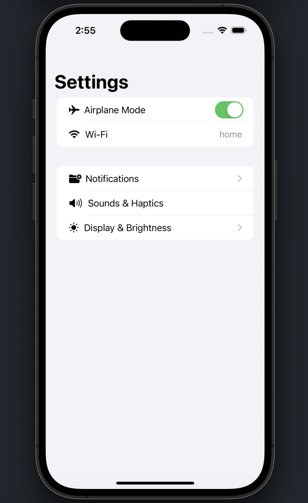
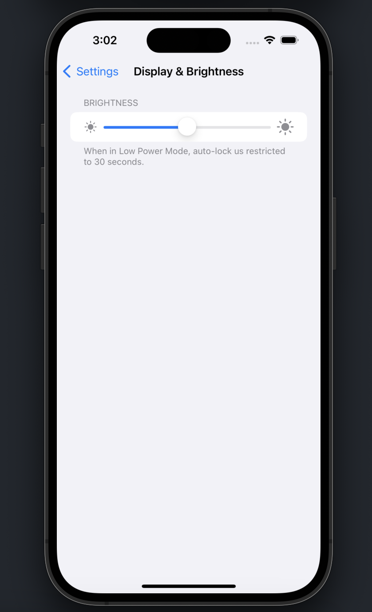

## Settings Screens

A simple project just to put Swift 'view' concepts into practice for learning purposes / Projeto simples apenas para colocar em prática conceitos de "view" no Swift com objetivo de aprendizagem

## Screenshots

  
  

## Requisitos

1. Xcode 14.0

## Como rodar o projeto
1. Clone este repositório
2. Instale as ferramentas de desenvolvimento: `brew bundle && bundle install`
3. Selecione o target `SettingsScreens` e execute o aplicativo no simulator

## Tecnologias Utilizadas

Swift & SwiftUI

## Autores

